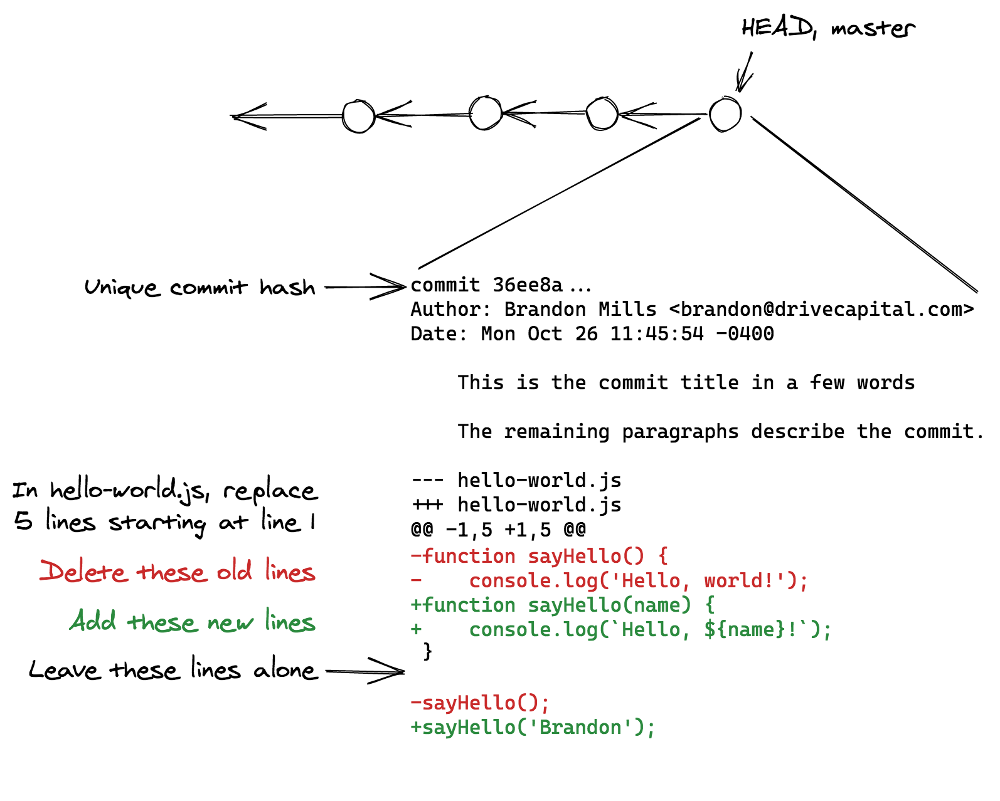
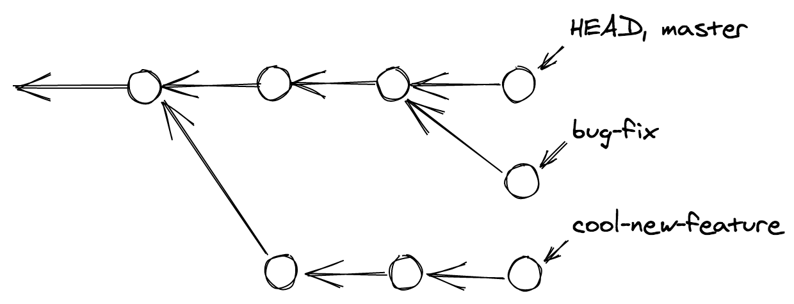
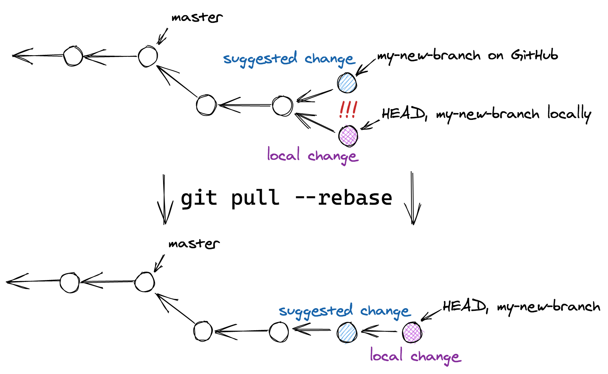
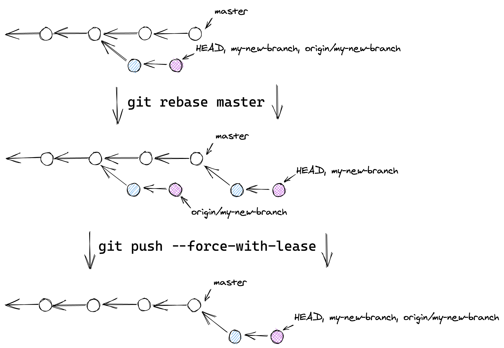

# Git

## Contents

1. [Core Concepts]
    1. [Commits]
    1. [`HEAD`]
    1. [Branches]
    1. [Pushing and pulling]
1. [Working on code]
    1. [Starting a feature or bug fix]
    1. [Committing changes]
    1. [Opening a pull request]
        1. [Review feedback]
        1. [Suggested changes]
        1. [Rejected push]
    1. [Merge conflicts]
1. [Git etiquette]
    1. [One focus per pull request]
    1. [Tell a linear story]
1. [Advanced usage]
    1. [Reverting a pull request]
    1. [Committing only part of a file]
    1. [Un-staging changes]
    1. [Cherry-picking commits]
    1. [Interactive rebase]
        1. [Re-ordering commits]
        1. [Fixing prior commits]
        1. [Splitting up commits]
1. [Configuration]

This guide assumes Git version 2.28.0.
You can install it from [Homebrew](https://brew.sh/) with `brew install git`.
The version of Git that comes with macOS is older, so if some of these commands don't work, check `git --version`.

## Core Concepts

### Commits

A commit is the core unit of change in Git.
Each commit adds or removes lines in files.



Every commit has a hexadecimal hash (`36ee8abf2`...) that uniquely identifies it among all the other commits in the repository.
`git log` shows the full 40-character hash for each commit.
Since 40-character hashes are cumbersome, GitHub often shows just the first 6-9 characters of the hash (`36ee8ab`), just enough to identify it uniquely, and hides the rest.

Commits point to their parent commit.
For example, if I make three commits in a repository, A &larr; B &larr; C, C would be the most recent commit, B its parent, and C its grandparent.
`git log` shows the most recent commit and all of its parents.

Git can reconstruct the repository at any point in time by applying the sequence of added and removed lines in the commit chain.
When we make changes by adding commits or merging pull requests, Git looks at those commits to know which lines to add and remove.

### `HEAD`

In Git, `HEAD` is a special alias for the most recent commit.
It's whichever commit `git log` would show first.
When we create a new commit, the previous `HEAD` commit is the new commit's parent, and then `HEAD` is updated to point to the new commit.

### Branches

Branches are special labels that point to commits.
`master` is a regular branch whose label is "master".
Sometimes repositories choose to call it `main` instead.
Because we start work by branching from `master`, our branches look like a tree with `master` as the trunk.
We can follow commits' parents in a chain and eventually end up back in the `master` trunk.



We can create our own branches with `git branch new-branch-name`.
This will create a new label pointing to the most recent commit.

We can switch between branches with `git switch other-branch`.

When we create a new commit, the current branch's label automatically updates from the previous commit to the new commit.

### Pushing and pulling

Our laptops, GitHub, and each Heroku environment all have their own copy of our repository.
These repositories keep track of branches and commits separately.
We use `git push` and `git pull` to copy commits and branch labels between repositories.

`git remote --verbose` lists all of the other repositories that Git knows about.
GitHub is typically called `origin`, and `production` and `staging` might be names for Heroku's repositories.

When we push a new branch to GitHub, it pushes all of the commits we've made locally and then tells GitHub to create its own copy of the branch label pointing to the most recent commit.

When we push new commits to an existing branch in GitHub, Git sends GitHub all the new commits that are in our laptop's branch but not yet in GitHub's branch and updates GitHub's branch label to point to the newest commit.

Pulling works in reverse.
When we pull a branch from GitHub, Git retrieves all the commits that are in GitHub but not yet on our laptop and updates our laptop's branch label to point to the newest commit.

## Working on code

The `master` branch should be the authoritative source for what exists in production.
Changes should only reach `master` when the tests are passing and they're ready for production.

### Starting a feature or bug fix

We work on in-progress changes in "feature branches" off of `master`.
We feature branch might implement a new feature, add a test, change some copy, or fix a bug.

```sh
# Make sure we're starting our branch off of master.
$ git switch master
# And make sure we have the latest changes from master on GitHub.
$ git pull
# Create the feature branch from master. Name it something descriptive, like
# `very-cool-feature` or `fix-issue-123`.
$ git branch new-branch-name
# Switch to the new branch.
$ git switch new-branch-name
```

At this point, we're working on the `new-branch-name` branch.
For now, `HEAD`, `new-branch-name`, and `master` all point to the same most recent commit.
Any new commits will be added to `new-branch-name` but not `master`.

### Committing changes

Once we've made a change, we use `git add` to prepare the added and removed lines to be turned into a commit.
When we `git add` a file, it goes into a "staging" area, which is like a waiting room for the lines that will be in a commit.

```sh
# Show what files have been changed since the last commit.
$ git status
# Add a file.
$ git add hello-world.js
# Show that hello-world.js has been added to the commit staging area.
$ git status
# Turn the staged files into a commit.
$ git commit
```

The `git commit` command will open a text editor where you can write a title and message for your commit.
The title is a short description in a few words.
The message contains a more detailed description of what changes we made and why.
If we're adding a new feature, we describe the feature's design and how it's built.
If we're fixing a bug, we describe what caused the bug and why this is the right way to fix it.

### Opening a pull request

Congrats!
We've implemented a new feature or fixed a bug.
All the steps in the change are nicely packaged as line changes in commits.
It's time to open a pull request in GitHub.

```sh
# Tell GitHub about our new commits and branch.
$ git push --set-upstream origin my-new-branch
```

`git push` copies all of the new commits to GitHub and creates a copy of our branch label.
`origin` is Git's name for GitHub's copy of our repository.
`--set-upstream` tells Git to remember that we pushed `my-new-branch` to GitHub, so in the future, just `git push` will automatically go to GitHub.
Now go to GitHub and fill out your pull request.

#### Review feedback

We've received review feedback on the pull request and need to make changes.
Make commits just like when we were working on the change initially.

```sh
# Show the files we've updated in response to feedback.
$ git status
# Add them to the staging area for the next commit.
$ git add hello-world.js
# Commit our review fixes.
$ git commit
# Push the fixed commits to GitHub.
$ git push
```

Git will send our review feedback changes to GitHub, update GitHub's `my-new-branch` branch label to point to the new commits, and show them in the pull request.
In the `push` step, since we used `--set-upstream` when we first pushed the branch to GitHub, we don't need to specify `origin my-new-branch` again because Git remembers those settings.
It's the same as running `git push origin my-new-branch`, just with less typing.

#### Suggested changes

Sometimes reviewers leave small suggested changes in review comments.
Committing these suggestions to the pull request is quick and easy without ever leaving GitHub.
After you commit review suggestions from GitHub, be sure to update your local repository so it knows about the new commits.

```sh
# Switch to the pull request's branch.
$ git switch my-new-branch
# Update the local branch with the suggested change commits from GitHub.
$ git pull
```

#### Rejected push

If we forget to update our local branch when there are new commits in GitHub's copy of the branch, Git will reject our next push to the pull request.
**Never** run `git push` with `--force`.
That would overwrite the suggested change commits from GitHub, losing work.
Git rejected the push because there are commits in GitHub's copy of `my-new-branch` that are missing from our local copy of `my-new-branch`.
We want to combine the commits from all versions of the branch.
Run `git pull --rebase` to take the suggested change commits from GitHub and then replay our local commits after them.



```sh
# Git rejects our push because our local branch is missing some commits.
$ git push
To https://github.com/drivecapital/git-workflow.git
 ! [rejected]            my-new-branch -> my-new-branch (non-fast-forward)
error: failed to push some refs to 'https://github.com/drivecapital/git-workflow.git'
hint: Updates were rejected because the tip of your current branch is behind
hint: its remote counterpart. Integrate the remote changes (e.g.
hint: 'git pull ...') before pushing again.
hint: See the 'Note about fast-forwards' in 'git push --help' for details.
# Pull the newer commits from GitHub and replay our local commits after them.
$ git pull --rebase
# Now we can push the combined commits to GitHub.
$ git push
```

### Merge conflicts

Sometimes GitHub says we can't merge a pull request because we have merge conflicts.
This happens when a teammate worked on the same lines in a different branch.
A merge conflict is a place where we need to update our change to account for changes already made by a teammate.

First, we need to pull the latest changes from GitHub's `master` branch label to our laptop.

```sh
# Switch to our local master branch.
$ git switch master
# Retrieve the new commits from GitHub.
$ git pull
# Switch back to our feature branch.
$ git switch my-new-branch
# Re-play all of the commits in our branch on top of newer changes in master.
$ git rebase master
```

At some point during the `rebase`, Git will stop because it came to a commit that changed lines that have more recent updates in `master`.
This could be simple if a teammate renamed a variable and our commit still uses its old name.
Perhaps a teammate refactored a method, and our commit wants to change code that's now in a different place.

```sh
# Show which files we need to update.
$ git status
Unmerged paths:
  (use "git restore --staged <file>..." to unstage)
  (use "git add <file>..." to mark resolution)
	both modified:   hello-world.js
```

For a contrived example, let's say we have a `sayHello()` function.
A teammate just merged a pull request to `master` that added a `name` parameter to say "Hello" to people by name.
But in our feature branch, we updated it to say "Greetings" instead.

```js
<<<<<< Changes from teammate's commit "Say hello by name" in master
function sayHello(name) {
	console.log(`Hello, ${name}!`);
======
function sayHello() {
	console.log('Greetings, world!');
>>>>>> Changes from our commit "Greet the world instead" in my-new-branch
}

sayHello('Brandon');
```

If we take just their change, <code>console.log(&#96;Hello, ${name}!&#96;);</code> would lose our "Greetings" change.
If we take just our change, `console.log("Greetings, world!");` would undo their already-merged change.
We need to manually combine the changes into <code>console.log(&#96;Greetings, ${name}!&#96;);</code> to include both updates.

```sh
# Now that we've resolved the merge conflict, add the file to the commit staging area.
$ git add hello-world.js
# Optionally take a look at our updated changes.
$ git diff --staged
# And continue with the rebase.
$ git rebase --continue
```

Now we need to send the updated commits and branch label to GitHub.
If we were to run `git push` right now, Git would reject the push.
Instead of adding new commits to the branch on GitHub, we want to _replace_ the existing commits with our updated commits.
For this, we use `git push --force-with-lease`.
Git will replace the commits, but it will also protect us from overwriting any new commits on the branch.



If we've added commits from review suggestions on GitHub but forgot to pull them down before rebasing, Git will reject the push even with `--force-with-lease` because the push would overwrite the suggestion commits.
We need to start over and pull the suggestion commits before performing the rebase.

```sh
# Switch to our feature branch.
$ git switch my-new-branch
# Start over back where the pull request is.
$ git reset --hard origin/my-new-branch
# Pull any new commits from the pull request.
$ git pull
# Now re-do the rebase on master.
$ git rebase master
# After resolving merge conflicts and finishing the rebase, update the pull request.
$ git push --force-with-lease
```

## Git etiquette

Good Git usage reflects empathy for code reviewers.

### One focus per pull request

A pull request is easiest to review when it has one focus.
A single-commit pull request with a three-line styling change and before and after screenshots in the description takes no time at all to review.
Better yet, it won't be open long enough for another change to create a merge conflict.

Implementing features will never be that simple, but keeping them focused will pay off in less painful code reviews.
If we stumble across an existing bug while working on a feature, putting the fix in its own pull request will have it fixed in production before we're ever done implementing the feature.
The feature pull request will be easier to review and less likely to encounter a merge conflict because it no longer includes an unrelated change.

```sh
# Found a bug while working on cool-feature!
# Stash changes to come back to them later.
$ git stash
# Head back to master and check for newer changes.
$ git switch master
$ git pull
# Start a new branch for the bug fix.
$ git branch fix-bug
$ git switch fix-bug
# After fixing the bug, commit the change, push the branch, and open a pull request.
$ git add fixed-file.js
$ git commit
$ git push --set-upstream origin fix-bug
# Switch back to cool-feature and unstash changes to pick up where we left off.
$ git switch cool-feature
$ git stash pop
```

If a feature is particularly large, we can break it up into multiple pull requests.
The first pull request could include the model, migration, and API endpoint.
While that's in code review, we can keep working on a second pull request to use the new API from the client.
This prevents individual code reviews from taking weeks of back-and-forth talking about different parts of the changes.

```sh
# We've finished part one of our feature. Create a pull request.
$ git switch feature-part-one
$ git push --set-upstream origin feature-part-one
# Start a new branch starting from part one's branch label.
$ git branch feature-part-two
$ git switch feature-part-two
# ...
# Keep committing to feature-part-two.
# ...
# When feature-part-one is approved and merged to master, rebase part two on top of master.
$ git switch master
$ git pull
$ git switch feature-part-two
$ git rebase master
```

Advanced tools like [`git cherry-pick`][Cherry-picking commits] can help pull bug fixes or refactors from larger branches into their own standalone pull requests.

### Tell a linear story

The development process is messy and non-linear.
We often iterate to a solution with false starts along the way, but reviewers care more about where we ended than the roundabout way we got there.

The ideal pull request tells a linear story where each commit is a logical step.
The reviewer doesn't need to know that we wrote a serializer, then we started building the client, then we realized we missed a serializer field, oh and then we found a typo in a variable name.
Alternatively, finishing a feature and then leaving one "big bang" commit at the end leaves the reviewer to find their own way through how it works.
When each commit is a logical step, we can guide the reviewer through the implementation.

When we have un-committed changes in a file that we want to commit as multiple steps, we can [commit only part of a file][Committing only part of a file] to pick changes for each commit.

If we want to go back and tweak a step that was already committed, we can [fix up a prior commit][Fixing prior commits] by combining more added and removed lines into the original commit.

If we're done working but decide the story makes more sense with the steps in a different order, we can [re-order commits][Re-ordering commits].

If we realize a commit does too many different things, we can [split it up][Splitting up commits] into individual commits.

## Advanced usage

### Reverting a pull request

If we just merged and deployed a pull request that broke everything and we can't fix it in a hurry, the revert button is the nuclear option.
Clicking the "revert" button on the offending pull request will reverse all of its changes, removing the lines it added and adding back the lines it removed.
If we do a good job submitting pull requests that make logically grouped changes and splitting unrelated changes into their own pull requests, we should be able to revert just the pull request that caused the breakage.
We shouldn't need to use the `git revert` command locally.

### Committing only part of a file

Each commit should do one thing.
If we've fixed two unrelated bugs, we'd like to create two commits, one to fix each bug.
We don't have to `git add` an entire file at once. Instead, we can add only part of a file.

```sh
# Start an interactive session to stage lines for the commit a chunk at a time.
$ git add --patch
```

`git add --patch` will go through the changes one chunk of lines at a time.
Typing `?` at the prompt will show help instructions.
`y` will stage this chunk of lines for inclusion in the next commit.
`n` will leave this chunk of lines unstaged for a later commit.
If the chunk of lines is too big, split it into even smaller chunks with `s`, then stage or skip the sub-chunks with `y` or `n`.

### Un-staging changes

If you've added a file to the commit staging area and don't want it to be part of the commit, you can remove it from the staging area before committing.

```sh
# Show the files in the staging area for the next commit. Whoops, hello-world.js
# isn't supposed to be part of this commit! Let's leave it for a later commit.
$ git status
# Remove hello-world.js from the staging area.
$ git unstage
# Show that hello-world.js has been removed from the commit staging area. A new
# commit now would not include the added and removed lines in hello-world.js.
$ git status
```

### Cherry-picking commits

_TODO_

### Interactive rebase

#### Re-ordering commits

_TODO_

#### Fixing prior commits

_TODO_

#### Splitting up commits

_TODO_

## Configuration

When pulling from GitHub, only allow "fast forwards".
When "fast forwarding", if your local branch contains commits A, B, C, and GitHub has A, B, C, D, E, pulling will add D and E to your local branch.

```sh
$ git config --global pull.ff only
```

Enable [branch protection](https://docs.github.com/en/free-pro-team@latest/github/administering-a-repository/about-protected-branches) in your GitHub repository's settings:

- `master`
    - Don't allow force pushes
        - This only applies to `master`.
        - We can still `--force-with-lease` to feature branches in advanced uses.
    - Don't allow deletions
    - Include administrators
        - Prevents even organization owners from accidentally force pushing to `master`.
        - If 💩 hits the fan and you really need to, you can temporarily un-check this.
    - Optionally, require pull request reviews before merging
        - Changes must go through code review.
        - Prevents accidentally pushing directly to `master`.
    - Optionally, require status checks to pass before merging
        - If your automated tests aren't flaky.
    - Optionally, require linear history
        - Forces people to resolve conflicts via rebasing their feature branch on `master` instead of merge commits.

[Advanced usage]: #advanced-usage
[Branches]: #branches
[Cherry-picking commits]: #cherry-picking-commits
[Commits]: #commits
[Committing changes]: #committing-changes
[Committing only part of a file]: #committing-only-part-of-a-file
[Configuration]: #configuration
[Core Concepts]: #core-concepts
[Fixing prior commits]: #fixing-prior-commits
[Git etiquette]: #git-etiquette
[`HEAD`]: #head
[Interactive rebase]: #interactive-rebase
[Merge conflicts]: #merge-conflicts
[One focus per pull request]: #one-focus-per-pull-request
[Opening a pull request]: #opening-a-pull-request
[Pushing and pulling]: #pushing-and-pulling
[Re-ordering commits]: #re-ordering-commits
[Rejected push]: #rejected-push
[Reverting a pull request]: #reverting-a-pull-request
[Review feedback]: #review-feedback
[Splitting up commits]: #splitting-up-commits
[Starting a feature or bug fix]: #starting-a-feature-or-bug-fix
[Suggested changes]: #suggested-changes
[Tell a linear story]: #tell-a-linear-story
[Un-staging changes]: #un-staging-changes
[Working on code]: #working-on-code
